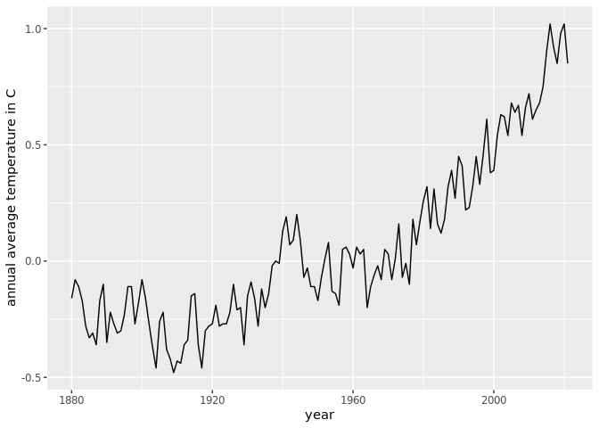
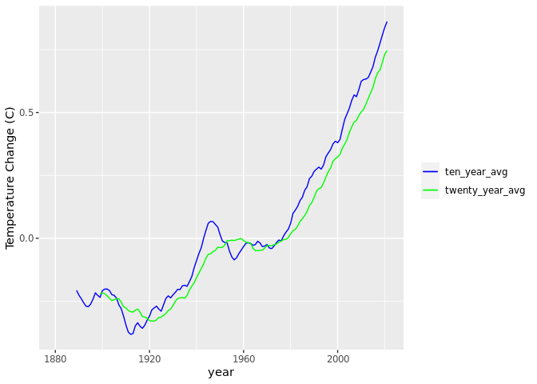
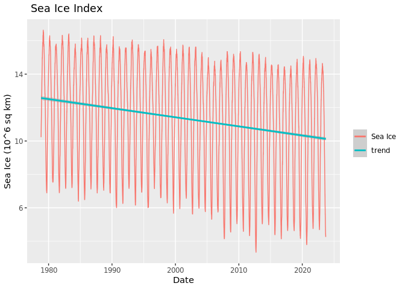

Mark and Jiawen Climate Project
================
Carl Boettiger & Dana Seidel & Mark Sun & Jiawen Tang

# Unit I: Climate Change Module

## Warm-up exercise: Examining CO2 trends in R

- Example from <http://climate.nasa.gov/vital-signs/carbon-dioxide/>
- Raw data from
  <https://gml.noaa.gov/webdata/ccgg/trends/co2/co2_mm_mlo.txt>

``` r
library(tidyverse)
```

``` r
co2 <- 
read_table("https://gml.noaa.gov/webdata/ccgg/trends/co2/co2_mm_mlo.txt", 
                  comment="#",
                  col_names = c("year", "month", "decimal_date", "monthly_average",
                                "interpolated", "days","std", ""),
                  na = c("-1", "-9.99","-0.99"))
co2
```

    ## # A tibble: 786 × 8
    ##     year month decimal_date monthly_average interpolated  days   std    ``
    ##    <dbl> <dbl>        <dbl>           <dbl>        <dbl> <dbl> <dbl> <dbl>
    ##  1  1958     3        1958.            316.         314.    NA    NA    NA
    ##  2  1958     4        1958.            317.         315.    NA    NA    NA
    ##  3  1958     5        1958.            318.         315.    NA    NA    NA
    ##  4  1958     6        1958.            317.         315.    NA    NA    NA
    ##  5  1958     7        1959.            316.         315.    NA    NA    NA
    ##  6  1958     8        1959.            315.         316.    NA    NA    NA
    ##  7  1958     9        1959.            313.         316.    NA    NA    NA
    ##  8  1958    10        1959.            312.         315.    NA    NA    NA
    ##  9  1958    11        1959.            313.         315.    NA    NA    NA
    ## 10  1958    12        1959.            315.         315.    NA    NA    NA
    ## # ℹ 776 more rows

``` r
ggplot(co2, aes(x = decimal_date)) + 
  geom_line(aes(y=monthly_average),col="blue")+
  geom_line(aes(y=interpolated),col="red")
```

<!-- -->

Which months are the CO2 values at the maximum? Minimum? Why is this?
May is the maximum and October is the minimum; since 90% of the FF
emission in northern hemisphere and photosynthesis will help reduce.
What rolling average is used in computing the “trend” line? How does the
trend depend on the rolling average?

------------------------------------------------------------------------

# Exercise I: Temperature Data

Each of the last years has consecutively set new records on global
climate. In this section we will analyze global mean temperature data.

Data from: <http://climate.nasa.gov/vital-signs/global-temperature>

## Question 1:

Describe the data set to the best of your ability given the
documentation provided. Describe what kind of column each data contains
and what units it is measured in. Then address our three key questions
in understanding this data:

- How are the measurements made? What is the associated measurement ?
- What is the resolution of the data?
- Are their missing values? How should they be handled?

The data source is NASA/GISS. While the article doesn’t articulate how
the measurements are made,it is likely they study ice cores to construct
past global mean temperature.The associated measurement may be inherent
difficulty to make exact predictions. The resolution of the data, which
refers to “the period of time represented by each data point that is
collected for the report”, is a year, since every data point corresponds
to each year’s annual mean temp. The data set is complete (no missing
values), if there are, they may be represented with “NA” and wiill not
be considered in analysis.

## Question 2:

Construct the necessary R code to import and prepare for manipulation
the following data set:
<http://climate.nasa.gov/system/internal_resources/details/original/647_Global_Temperature_Data_File.txt>

``` r
climate <- read_table("http://climate.nasa.gov/system/internal_resources/details/original/647_Global_Temperature_Data_File.txt",
           col_names = c("year", "annual_average", "five_year_average"),
           na="NA",
           col_types = ('ddd'),
           skip = 5
           )
climate
```

    ## # A tibble: 142 × 3
    ##     year annual_average five_year_average
    ##    <dbl>          <dbl>             <dbl>
    ##  1  1880          -0.16             -0.09
    ##  2  1881          -0.08             -0.13
    ##  3  1882          -0.11             -0.16
    ##  4  1883          -0.17             -0.2 
    ##  5  1884          -0.28             -0.24
    ##  6  1885          -0.33             -0.26
    ##  7  1886          -0.31             -0.27
    ##  8  1887          -0.36             -0.27
    ##  9  1888          -0.17             -0.26
    ## 10  1889          -0.1              -0.25
    ## # ℹ 132 more rows

## Question 3:

Plot the trend in global mean temperatures over time. Describe what you
see in the plot and how you interpret the patterns you observe.

``` r
ggplot(climate, aes(x = year, y = annual_average)) + geom_line()
```

<!-- -->

There is a annual variation in the temperature mean, but the trend is
increasing after 1920 and with a stronger signal after 1960. It
indicates the temperature is increase compare to average.

## Question 4: Evaluating the evidence for a “Pause” in warming?

The [2013 IPCC
Report](https://www.ipcc.ch/pdf/assessment-report/ar5/wg1/WG1AR5_SummaryVolume_FINAL.pdf)
included a tentative observation of a “much smaller increasing trend” in
global mean temperatures since 1998 than was observed previously. This
led to much discussion in the media about the existence of a “Pause” or
“Hiatus” in global warming rates, as well as much research looking into
where the extra heat could have gone. (Examples discussing this question
include articles in [The
Guardian](http://www.theguardian.com/environment/2015/jun/04/global-warming-hasnt-paused-study-finds),
[BBC News](http://www.bbc.com/news/science-environment-28870988), and
[Wikipedia](https://en.wikipedia.org/wiki/Global_warming_hiatus)).

By examining the data here, what evidence do you find or not find for
such a pause? Present an analysis of this data (using the tools &
methods we have covered in Foundation course so far) to argue your
case.  
What additional analyses or data sources would better help you refine
your arguments?

By looking at the data, I did not find evidence in support of such a
hiatus around 1998. The graph above showing global mean temperatures
over time depicts a rather consistent, steady raise in global mean
temperature since 1998.There is not a pause or decrease in the trend.
Some additional analysis that may help could be determining the rate of
global temperature change by performing regression analysis.

## Question 5: Rolling averages

- What is the meaning of “5 year average” vs “annual average”? 5 year
  average is the rolling average that smooth the annual variation signal
  in the data, and compare to annual average, it shows a more smooth
  trend of increase in temperature.
- Construct 5 year averages from the annual data. Construct 10 & 20-year
  averages.
- Plot the different averages and describe what differences you see and
  why.

``` r
ggplot(climate,aes(x= year, y = five_year_average)) + geom_line()
```

<!-- -->

``` r
#ggplot(co2, aes(x = decimal_date, y = monthly_average)) + geom_line() 

library(dplyr)
library(zoo)
```

    ## 
    ## Attaching package: 'zoo'

    ## The following objects are masked from 'package:base':
    ## 
    ##     as.Date, as.Date.numeric

``` r
#calculate 10-year & 20-year rolling average
climate = climate %>%
  mutate(ten_year_avg = rollmean(climate$annual_average, k=10, fill=NA, align='right'),
         twenty_year_avg = rollmean(climate$annual_average, k=20, fill=NA, align='right'));
climate
```

    ## # A tibble: 142 × 5
    ##     year annual_average five_year_average ten_year_avg twenty_year_avg
    ##    <dbl>          <dbl>             <dbl>        <dbl>           <dbl>
    ##  1  1880          -0.16             -0.09       NA                  NA
    ##  2  1881          -0.08             -0.13       NA                  NA
    ##  3  1882          -0.11             -0.16       NA                  NA
    ##  4  1883          -0.17             -0.2        NA                  NA
    ##  5  1884          -0.28             -0.24       NA                  NA
    ##  6  1885          -0.33             -0.26       NA                  NA
    ##  7  1886          -0.31             -0.27       NA                  NA
    ##  8  1887          -0.36             -0.27       NA                  NA
    ##  9  1888          -0.17             -0.26       NA                  NA
    ## 10  1889          -0.1              -0.25       -0.207              NA
    ## # ℹ 132 more rows

``` r
ggplot(climate,aes(x= year)) + 
  geom_line(aes(y = ten_year_avg, color = 'ten')) + 
  geom_line(aes(y = twenty_year_avg, color = 'twenty')) +
  labs(y = "Temperature Change (C)", color = NULL) +
  scale_color_manual(values = c(ten = "blue", twenty = "green"),
                      labels = c(ten = "ten_year_avg", twenty = "twenty_year_avg"),
                      limits = c("ten", "twenty"))
```

    ## Warning: Removed 9 rows containing missing values (`geom_line()`).

    ## Warning: Removed 19 rows containing missing values (`geom_line()`).

<!-- -->

The data looks more flat as the average year increases, becoming more
pronounced and losing some of the temperature fluctuations caused by
special events.

# Exercise II: Melting Ice Sheets?

- Data description: <http://climate.nasa.gov/vital-signs/land-ice/>
- Raw data file:
  <http://climate.nasa.gov/system/internal_resources/details/original/499_GRN_ANT_mass_changes.csv>

## Question 1:

- Describe the data set: what are the columns and units? Where do the
  numbers come from? The columns are time in decimal year, greenland and
  antarctica ice sheet mass in Giga tonnes. The data are collected NASA
  GRACE and GRACE Follow-On satelite, which are gravitational satelites
  that measure the land change by change of gravitational force.
- What is the in measurment? Resolution of the data? Interpretation of
  missing values? The GRACE mission ended in June 2017. The GRACE
  Follow-On mission began collecting data in June 2018, with some lost
  data in the middle. The record includes new data processing methods
  and is constantly updated as more data comes in, with a delay of up to
  two months. Ice sheet data are measured about 12 times a year. \##
  Question 2:

Construct the necessary R code to import this data set as a tidy `Table`
object.

``` r
IceMass<-read_csv("http://climate.nasa.gov/system/internal_resources/details/original/499_GRN_ANT_mass_changes.csv",
              col_names = c("year","greenland","antarctica"),
              col_types = ('ddd'),
              skip = 10)
IceMass
```

    ## # A tibble: 140 × 3
    ##     year greenland antarctica
    ##    <dbl>     <dbl>      <dbl>
    ##  1 2002.     1491.       967.
    ##  2 2002.     1486.       979.
    ##  3 2003.     1287.       512.
    ##  4 2003.     1258.       859.
    ##  5 2003.     1257.       694.
    ##  6 2003.     1288.       592.
    ##  7 2003.     1337.       658.
    ##  8 2003.     1354.       477.
    ##  9 2003.     1363.       546.
    ## 10 2003.     1427.       494.
    ## # ℹ 130 more rows

## Question 3:

Plot the data and describe the trends you observe.

``` r
ggplot(IceMass,aes(x= year)) + 
  geom_line(aes(y = greenland, colour = 'Greenland' )) + 
  geom_line(aes(y = antarctica, colour = 'Antarctica')) +
  ggtitle('Icesheet mass change over time') +
  labs(y = "Change of ice mass (Gt)", color = NULL)
```

<!-- -->

Both ice sheets showed a clear declining trend and the presence of
seasons was evident. Greenland, which is located in the Arctic, was
affected by positive feedback more, and the weight of the ice sheet
dropped faster.

# Exercise III: Rising Sea Levels?

- Data description: <http://climate.nasa.gov/vital-signs/sea-level/>
- Raw data file:
  <http://climate.nasa.gov/system/internal_resources/details/original/121_Global_Sea_Level_Data_File.txt>

## Question 1:

- Describe the data set: what are the columns and units? There are 12
  columns in the data set and we are only going to present 3 of them to
  make the table clean and useful. The 12 columns are: HDR 1 altimeter
  type 0=dual-frequency 999=single frequency (ie Poseidon-1) HDR 2
  merged file cycle \# HDR 3 year+fraction of year (mid-cycle) HDR 4
  number of observations HDR 5 number of weighted observations HDR 6
  GMSL (Global Isostatic Adjustment (GIA) not applied) variation (mm)
  with respect to TOPEX collinear mean reference HDR 7 standard
  deviation of GMSL (GIA not applied) variation estimate (mm) HDR 8
  smoothed (60-day Gaussian type filter) GMSL (GIA not applied)
  variation (mm)  
  HDR 9 GMSL (Global Isostatic Adjustment (GIA) applied) variation (mm)
  with respect to TOPEX collinear mean reference HDR 10 standard
  deviation of GMSL (GIA applied) variation estimate (mm) HDR 11
  smoothed (60-day Gaussian type filter) GMSL (GIA applied)
  variation (mm) HDR 12 smoothed (60-day Gaussian type filter) GMSL (GIA
  applied) variation (mm); annual and semi-annual signal removed

- Where do these data come from? The calculations were performed by
  NASA’s Goddard Space Flight Center with support from NASA’s
  Measurement Program. GMSL is generated using integrated multi-mission
  ocean altimeter data. It combines sea surface heights from
  TOPEX/Poseidon, Jason-1, and OSTM/Jason-2 into a common ground
  reference frame.

- What is the in measurement? Resolution of the data? Interpretation of
  missing values? The data applies and places all inter-mission bias,
  range, and geophysical corrections in a georeference orbit. This
  creates a consistent data record throughout time, regardless of the
  instrument used.

## Question 2:

Construct the necessary R code to import this data set as a tidy `Table`
object.

``` r
SeaLevel<-read_table("http://climate.nasa.gov/system/internal_resources/details/original/121_Global_Sea_Level_Data_File.txt",
                     skip=45,
                     col_names = c("a","b","year","d","e","f","g","h","GMSL","j","k","Smoothed_60_days"),
                     na="99900")
```

    ## 
    ## ── Column specification ────────────────────────────────────────────────────────
    ## cols(
    ##   a = col_double(),
    ##   b = col_double(),
    ##   year = col_double(),
    ##   d = col_double(),
    ##   e = col_double(),
    ##   f = col_double(),
    ##   g = col_double(),
    ##   h = col_double(),
    ##   GMSL = col_double(),
    ##   j = col_double(),
    ##   k = col_double(),
    ##   Smoothed_60_days = col_double()
    ## )

``` r
SeaLevel<- SeaLevel[ ,c('year', 'GMSL', 'Smoothed_60_days')]
SeaLevel
```

    ## # A tibble: 847 × 3
    ##     year  GMSL Smoothed_60_days
    ##    <dbl> <dbl>            <dbl>
    ##  1 1993. -13.5           -14.1 
    ##  2 1993. -17.1           -14.7 
    ##  3 1993. -17.1           -14.2 
    ##  4 1993. -19.2           -14.2 
    ##  5 1993. -13.8           -13.0 
    ##  6 1993. -12.1           -11.8 
    ##  7 1993. -11.8           -10.6 
    ##  8 1993. -10.5            -9.73
    ##  9 1993. -10.7            -9.12
    ## 10 1993. -18.5            -8.76
    ## # ℹ 837 more rows

## Question 3:

Plot the data and describe the trends you observe.

``` r
ggplot(SeaLevel,aes(x= year)) + 
  geom_line(aes(y = GMSL, colour = 'GMSL' )) + 
  geom_line(aes(y = Smoothed_60_days, colour = 'Smoothed_60')) +
  ggtitle('Global Mean Sea Level change over time') +
  labs(y = "Change of sea level(mm)", color = NULL)
```

<!-- -->

The trend of sea level rise is very clear, and the seasonal and
meteorological effects are very strong, as can be seen by comparing the
rough curve. However, it has risen by about 10cm in 30 years, which is
already a very obvious upward trend.

# Exercise IV: Arctic Sea Ice?

- <http://nsidc.org/data/G02135>
- <ftp://sidads.colorado.edu/DATASETS/NOAA/G02135/north/daily/data/N_seaice_extent_daily_v3.0.csv>

## Question 1:

- Describe the data set: what are the columns and units?

There are 6 columns in the original file. Three of them are the time (in
year, month, and day of each recording. One column represents the
quantity (extent) of sea ice in 10^6 sq km. The other 2 columns
indicates missing data and source of data. We expurgated the data and
left only 2 columns: the time of recording and the extent of sea ice at
that tiume.

- Where do these data come from?

The data come from NSIDC (National Snow and Ice Data Center)

- What is the uncertainty in measurement? Resolution of the data?
  Interpretation of missing values?

The uncertainty in measurement may arise from tiny inaccuracy of data
measurment tools. Besides, the resort to time-series analysis may
involve small extent of interpolation, so the measurement may not be
exactly accurate and certain.The resolution of the data is 2 days, as
each recording time is separated by 2 days.There is no missing values as
they are all left as 0. In other words, this data sheet is consistent
and complete.

## Question 2:

Construct the necessary R code to import this data set as a tidy `Table`
object.

``` r
ArcticIce<-read_csv("ftp://sidads.colorado.edu/DATASETS/NOAA/G02135/north/daily/data/N_seaice_extent_daily_v3.0.csv",
              #col_names = c("year","greenland","antarctica"),
              col_types = ('ddddd'),
              skip = 0 )
```

    ## Warning: One or more parsing issues, call `problems()` on your data frame for details,
    ## e.g.:
    ##   dat <- vroom(...)
    ##   problems(dat)

``` r
ArcticIce$Date<-as.Date(with(ArcticIce,paste(Year,Month,Day,sep="-")),"%Y-%m-%d")
ArcticIce <- ArcticIce [ ,c('Date', 'Extent') ]
ArcticIce
```

    ## # A tibble: 14,741 × 2
    ##    Date       Extent
    ##    <date>      <dbl>
    ##  1 NA           NA  
    ##  2 1978-10-26   10.2
    ##  3 1978-10-28   10.4
    ##  4 1978-10-30   10.6
    ##  5 1978-11-01   10.7
    ##  6 1978-11-03   10.8
    ##  7 1978-11-05   11.0
    ##  8 1978-11-07   11.1
    ##  9 1978-11-09   11.2
    ## 10 1978-11-11   11.3
    ## # ℹ 14,731 more rows

## Question 3:

Plot the data and describe the trends you observe.

As shown in the plot, we observe a constant, gradually declining trend
of Sea Ice through time, from 1980 to 2020. There is also significant
seasonal fluctuations of Sea Ice each year. Overall, it’s clear that
more and more Sea Ice are disappearing.

``` r
ggplot(ArcticIce,aes(x= Date)) + 
  geom_line(aes(y = Extent, colour = 'Sea Ice' )) + 
  #geom_line(aes(y = Smoothed_60_days, colour = 'Smoothed_60')) +
  ggtitle(' Sea Ice Index ') +
  labs(y = "Sea Ice (10^6 sq km)", color = NULL) +
  geom_smooth(aes(y = Extent, colour = 'trend'), method=lm)
```

    ## `geom_smooth()` using formula = 'y ~ x'

    ## Warning: Removed 1 rows containing non-finite values (`stat_smooth()`).

    ## Warning: Removed 1 row containing missing values (`geom_line()`).

<!-- -->

# Exercise V: Longer term trends in CO2 Records

The data we analyzed in the unit introduction included CO2 records
dating back only as far as the measurements at the Manua Loa
observatory. To put these values into geological perspective requires
looking back much farther than humans have been monitoring atmosopheric
CO2 levels. To do this, we need another approach.

[Ice core data](http://cdiac.ornl.gov/trends/co2/ice_core_co2.html):

Vostok Core, back to 400,000 yrs before present day

- Description of data set:
  <http://cdiac.esd.ornl.gov/trends/co2/vostok.html>
- Data source: <http://cdiac.ornl.gov/ftp/trends/co2/vostok.icecore.co2>

## Questions / Tasks:

- Describe the data set: what are the columns and units? Where do the
  numbers come from?
- What is the in measurment? Resolution of the data? Interpretation of
  missing values?
- Read in and prepare data for analysis.
- Reverse the ordering to create a chronological record.  
- Plot data
- Consider various smoothing windowed averages of the data.
- Join this series to Mauna Loa data
- Plot joined data
- Describe your conclusions
