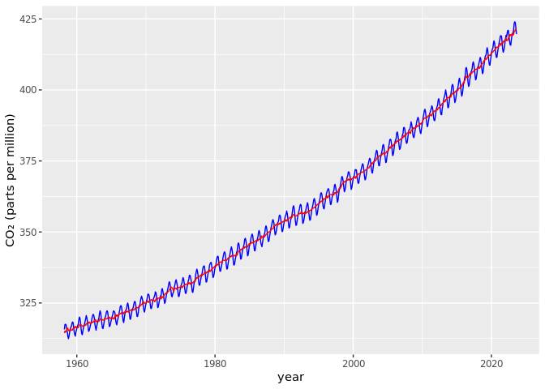

Mark and Jiawen Climate Project
================
Carl Boettiger & Dana Seidel & Mark Sun & Jiawen Tang

# Unit I: Climate Change Module

## Warm-up exercise: Examining CO2 trends in R

- Example from <http://climate.nasa.gov/vital-signs/carbon-dioxide/>
- Raw data from
  <https://gml.noaa.gov/webdata/ccgg/trends/co2/co2_mm_mlo.txt>

``` r
library(tidyverse)
```

``` r
co2 <- 
read_table("https://gml.noaa.gov/webdata/ccgg/trends/co2/co2_mm_mlo.txt", 
                  comment="#",
                  col_names = c("year", "month", "decimal_date", "monthly_average",
                                "interpolated", "days","std", "uncertainty"),
                  na = c("-1", "-9.99","-0.99"))
co2
```

    ## # A tibble: 785 × 8
    ##     year month decimal_date monthly_average interpolated  days   std uncertainty
    ##    <dbl> <dbl>        <dbl>           <dbl>        <dbl> <dbl> <dbl>       <dbl>
    ##  1  1958     3        1958.            316.         314.    NA    NA          NA
    ##  2  1958     4        1958.            317.         315.    NA    NA          NA
    ##  3  1958     5        1958.            318.         315.    NA    NA          NA
    ##  4  1958     6        1958.            317.         315.    NA    NA          NA
    ##  5  1958     7        1959.            316.         315.    NA    NA          NA
    ##  6  1958     8        1959.            315.         316.    NA    NA          NA
    ##  7  1958     9        1959.            313.         316.    NA    NA          NA
    ##  8  1958    10        1959.            312.         315.    NA    NA          NA
    ##  9  1958    11        1959.            313.         315.    NA    NA          NA
    ## 10  1958    12        1959.            315.         315.    NA    NA          NA
    ## # ℹ 775 more rows

``` r
ggplot(co2, aes(x = decimal_date, y = monthly_average)) + geom_line() 
```

<!-- -->

Which months are the CO2 values at the maximum? Minimum? Why is this?
May is the maximum and October is the minimum; since 90% of the FF
emission in northern hemisphere and photosynthesis will help reduce.
What rolling average is used in computing the “trend” line? How does the
trend depend on the rolling average?

------------------------------------------------------------------------

# Exercise I: Temperature Data

Each of the last years has consecutively set new records on global
climate. In this section we will analyze global mean temperature data.

Data from: <http://climate.nasa.gov/vital-signs/global-temperature>

## Question 1:

Describe the data set to the best of your ability given the
documentation provided. Describe what kind of column each data contains
and what units it is measured in. Then address our three key questions
in understanding this data:

- How are the measurements made? What is the associated measurement
  uncertainty?
- What is the resolution of the data?
- Are their missing values? How should they be handled?

The data source is NASA/GISS. While the article doesn’t articulate how
the measurements are made,it is likely they study ice cores to construct
past global mean temperature.The associated measurement uncertainty may
be inherent difficulty to make exact predictions. The resolution of the
data, which refers to “the period of time represented by each data point
that is collected for the report”, is a year, since every data point
corresponds to each year’s annual mean temp. The data set is complete
(no missing values), if there are, they may be represented with “NA” and
wiill not be considered in analysis.

## Question 2:

Construct the necessary R code to import and prepare for manipulation
the following data set:
<http://climate.nasa.gov/system/internal_resources/details/original/647_Global_Temperature_Data_File.txt>

``` r
climate <- read_table("http://climate.nasa.gov/system/internal_resources/details/original/647_Global_Temperature_Data_File.txt",
           col_names = c("year", "annual_average", "five_year_average"),
           na="NA",
           col_types = ('ddd'),
           skip = 5
           )
climate
```

    ## # A tibble: 142 × 3
    ##     year annual_average five_year_average
    ##    <dbl>          <dbl>             <dbl>
    ##  1  1880          -0.16             -0.09
    ##  2  1881          -0.08             -0.13
    ##  3  1882          -0.11             -0.16
    ##  4  1883          -0.17             -0.2 
    ##  5  1884          -0.28             -0.24
    ##  6  1885          -0.33             -0.26
    ##  7  1886          -0.31             -0.27
    ##  8  1887          -0.36             -0.27
    ##  9  1888          -0.17             -0.26
    ## 10  1889          -0.1              -0.25
    ## # ℹ 132 more rows

## Question 3:

Plot the trend in global mean temperatures over time. Describe what you
see in the plot and how you interpret the patterns you observe.

``` r
ggplot(climate,aes(x= year, y = annual_average)) + geom_line()
```

<!-- -->

``` r
#plot(climate$year,climate$annual_average)
```

## Question 4: Evaluating the evidence for a “Pause” in warming?

The [2013 IPCC
Report](https://www.ipcc.ch/pdf/assessment-report/ar5/wg1/WG1AR5_SummaryVolume_FINAL.pdf)
included a tentative observation of a “much smaller increasing trend” in
global mean temperatures since 1998 than was observed previously. This
led to much discussion in the media about the existence of a “Pause” or
“Hiatus” in global warming rates, as well as much research looking into
where the extra heat could have gone. (Examples discussing this question
include articles in [The
Guardian](http://www.theguardian.com/environment/2015/jun/04/global-warming-hasnt-paused-study-finds),
[BBC News](http://www.bbc.com/news/science-environment-28870988), and
[Wikipedia](https://en.wikipedia.org/wiki/Global_warming_hiatus)).

By examining the data here, what evidence do you find or not find for
such a pause? Present an analysis of this data (using the tools &
methods we have covered in Foundation course so far) to argue your
case.  
What additional analyses or data sources would better help you refine
your arguments?

By looking at the data, I did not find evidence in support of such a
hiatus around 1998. The graph above showing global mean temperatures
over time depicts a rather consistent, steady raise in global mean
temperature since 1998.There is not a pause or decrease in the trend.
Some additional analysis that may help could be determining the rate of
global temperature change by performing regression analysis.

## Question 5: Rolling averages

- What is the meaning of “5 year average” vs “annual average”?
- Construct 5 year averages from the annual data. Construct 10 & 20-year
  averages.
- Plot the different averages and describe what differences you see and
  why.

``` r
ggplot(climate,aes(x= year, y = five_year_average)) + geom_line()
```

<!-- -->

``` r
#ggplot(co2, aes(x = decimal_date, y = monthly_average)) + geom_line() 
```

# Exercise II: Melting Ice Sheets?

- Data description: <http://climate.nasa.gov/vital-signs/land-ice/>
- Raw data file:
  <http://climate.nasa.gov/system/internal_resources/details/original/499_GRN_ANT_mass_changes.csv>

## Question 1:

- Describe the data set: what are the columns and units? Where do the
  numbers come from?
- What is the uncertainty in measurment? Resolution of the data?
  Interpretation of missing values?

## Question 2:

Construct the necessary R code to import this data set as a tidy `Table`
object.

``` r
Ice<-read_csv("http://climate.nasa.gov/system/internal_resources/details/original/499_GRN_ANT_mass_changes.csv",
         skip = 9)
```

    ## Rows: 140 Columns: 3
    ## ── Column specification ────────────────────────────────────────────────────────
    ## Delimiter: ","
    ## dbl (3): TIME (year.decimal), Greenland mass (Gt), Antarctica mass (Gt)
    ## 
    ## ℹ Use `spec()` to retrieve the full column specification for this data.
    ## ℹ Specify the column types or set `show_col_types = FALSE` to quiet this message.

``` r
Ice
```

    ## # A tibble: 140 × 3
    ##    `TIME (year.decimal)` `Greenland mass (Gt)` `Antarctica mass (Gt)`
    ##                    <dbl>                 <dbl>                  <dbl>
    ##  1                 2002.                 1491.                   967.
    ##  2                 2002.                 1486.                   979.
    ##  3                 2003.                 1287.                   512.
    ##  4                 2003.                 1258.                   859.
    ##  5                 2003.                 1257.                   694.
    ##  6                 2003.                 1288.                   592.
    ##  7                 2003.                 1337.                   658.
    ##  8                 2003.                 1354.                   477.
    ##  9                 2003.                 1363.                   546.
    ## 10                 2003.                 1427.                   494.
    ## # ℹ 130 more rows

## Question 3:

Plot the data and describe the trends you observe.

``` r
plot(Ice$`TIME (year.decimal)`,Ice$`Greenland mass (Gt)`)
```

<!-- -->

# Exercise III: Rising Sea Levels?

- Data description: <http://climate.nasa.gov/vital-signs/sea-level/>
- Raw data file:
  <http://climate.nasa.gov/system/internal_resources/details/original/121_Global_Sea_Level_Data_File.txt>

## Question 1:

- Describe the data set: what are the columns and units?
- Where do these data come from?
- What is the uncertainty in measurment? Resolution of the data?
  Interpretation of missing values?

## Question 2:

Construct the necessary R code to import this data set as a tidy `Table`
object.

## Question 3:

Plot the data and describe the trends you observe.

# Exercise IV: Arctic Sea Ice?

- <http://nsidc.org/data/G02135>
- <ftp://sidads.colorado.edu/DATASETS/NOAA/G02135/north/daily/data/N_seaice_extent_daily_v3.0.csv>

## Question 1:

- Describe the data set: what are the columns and units?
- Where do these data come from?
- What is the uncertainty in measurement? Resolution of the data?
  Interpretation of missing values?

## Question 2:

Construct the necessary R code to import this data set as a tidy `Table`
object.

## Question 3:

Plot the data and describe the trends you observe.

# Exercise V: Longer term trends in CO2 Records

The data we analyzed in the unit introduction included CO2 records
dating back only as far as the measurements at the Manua Loa
observatory. To put these values into geological perspective requires
looking back much farther than humans have been monitoring atmosopheric
CO2 levels. To do this, we need another approach.

[Ice core data](http://cdiac.ornl.gov/trends/co2/ice_core_co2.html):

Vostok Core, back to 400,000 yrs before present day

- Description of data set:
  <http://cdiac.esd.ornl.gov/trends/co2/vostok.html>
- Data source: <http://cdiac.ornl.gov/ftp/trends/co2/vostok.icecore.co2>

## Questions / Tasks:

- Describe the data set: what are the columns and units? Where do the
  numbers come from?
- What is the uncertainty in measurment? Resolution of the data?
  Interpretation of missing values?
- Read in and prepare data for analysis.
- Reverse the ordering to create a chronological record.  
- Plot data
- Consider various smoothing windowed averages of the data.
- Join this series to Mauna Loa data
- Plot joined data
- Describe your conclusions
